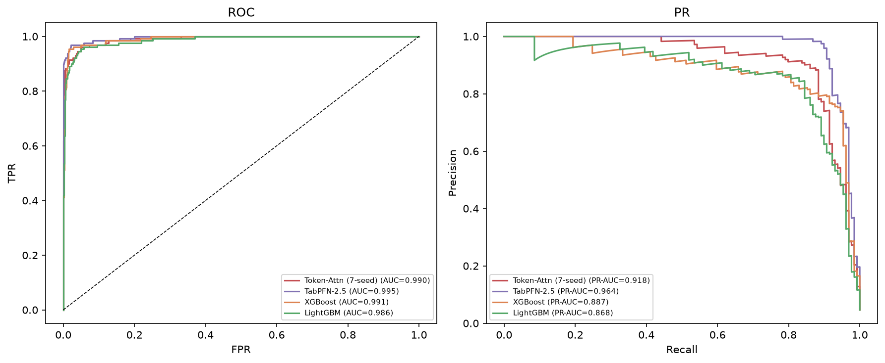
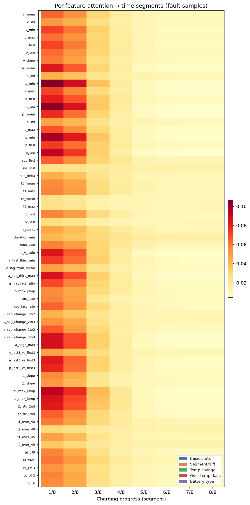
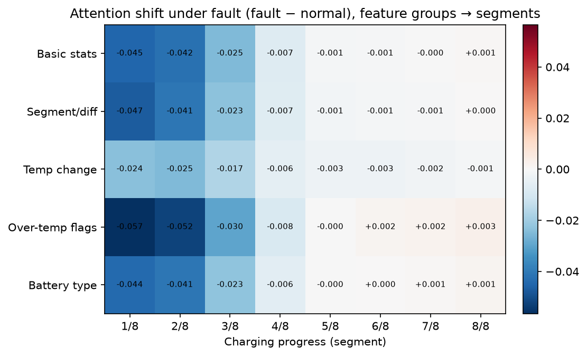
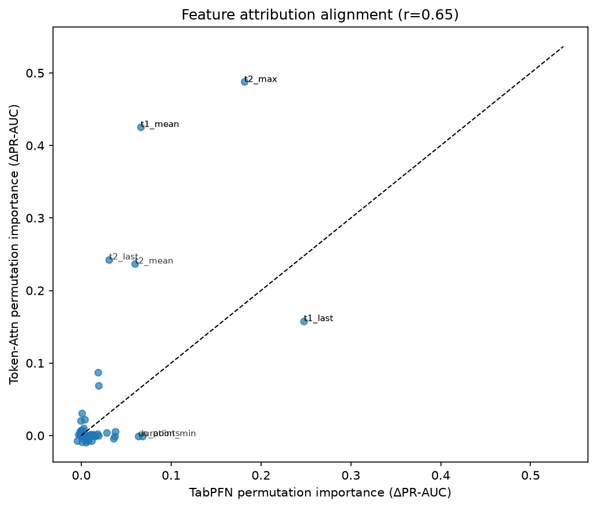

# 基于可解释人工智能的充电站网络异常检测:面向欧盟《人工智能法案》合规方案

**王莹**<sup>1</sup>,**陈天元**<sup>1</sup>,**朱禹林**<sup>2*</sup>

<sup>1</sup> 珠海学院 应用人工智能理学硕士
<sup>2</sup> 珠海学院 教授(通讯作者)

---

## 摘要

电动汽车充电基础设施的快速扩张对运营监控与故障诊断提出了严峻挑战。深度学习方法在充电站异常检测中取得了先进性能,但现有工作普遍缺乏对**跨站点泛化能力**与**监管合规要求**的系统性回应。本文基于深圳 30 座充电站真实运营数据(155.6 万采样点,2020-2024),提出一个面向充电站网络的可解释异常检测框架,主要包含三个模块:(1)**多模态注意力融合检测器(Token-Attn)**——双向 LSTM 将六通道原始充电时序(电压/电流/功率/枪温 1/枪温 2/SOC)编码后按充电进度分段池化为序列 token,与 62 维领域手工特征 token 及 [CLS] token 一同送入 Transformer 编码器做跨模态自注意力融合,让"序列"与"特征"在同一注意力空间互相查阅;(2)**双轨可解释归因**——自注意力权重对序列×特征做归因(哪个特征在关注哪段充电进程),置换特征重要性与特征组消融对手工特征分支做逐特征/逐组归因,三者交叉印证;(3)面向欧盟《人工智能法案》(EU AI Act)高风险系统的合规治理方案。在新站点(owner 7-8)跨域测试中,Token-Attn 经 7-seed 概率集成达到 **PR-AUC=0.918、AUC=0.990、F1=0.795(th=0.5)**,显著超越 GBDT 基线(LightGBM 0.868、XGBoost 0.887,bootstrap p=0.026),相比端到端纯 Bi-LSTM(PR-AUC=0.351)提升约 2.6 倍,并逼近表格基础模型 TabPFN-2.5 的 0.964(该任务"表格信号天花板"参照)。三路归因交叉印证:枪温统计量(t2_max/t1_mean 等)与基础统计量主导判别,异常时模型注意力从充电启动段向中后段漂移,共同支撑"大电流高功率段突然中断 + 温度异常"的故障指纹。本文进一步提出面向 EU AI Act 的合规方案(义务映射、审计日志、模型卡片),为关键基础设施 AI 系统的透明性与可追责性提供完整技术落地方案。

**关键词**:可解释人工智能,异常检测,电动汽车充电站,注意力融合,置换特征重要性,EU AI Act,关键基础设施

---

## 1. 引言

全球电动汽车充电基础设施正处于规模化扩张阶段。深度学习方法——尤其是 LSTM、Transformer 与图神经网络——已在充电站异常检测中展现出优于传统统计方法的性能 [14, 2]。然而,该领域存在两个关键缺口尚未得到系统性回应:

**第一,跨站点泛化问题。** 现有方法多在单一充电站或分布一致的数据上进行评估,而实际运营中的充电网络由地理分布各异、设备型号多样的站点组成。Yang 等人 [3] 指出,单全局模型在新站点上的性能会出现显著衰退,其通过站点自适应参数生成(基于 Hyper-Network 的个性化策略)使故障召回率提升至 73.56%。然而,这类个性化机制显著增加了系统复杂度,尚未有工作验证端到端深度时序模型能否在不引入复杂参数自适应机制的前提下解决跨站点泛化问题。

**第二,监管合规问题。** 欧盟《人工智能法案》[11] 将关键基础设施(包括电网与充电网络)的 AI 系统归类为"高风险",强制要求透明性(第 13 条)、人类监督(第 14 条)与日志记录(第 12 条)。现有异常检测方法普遍缺乏可解释性组件——仅输出异常分数,无法告知运维人员**哪个传感器驱动了告警**,这与监管要求之间存在显著鸿沟。

**本文贡献:**

1. 基于深圳 30 座充电站 155.6 万采样点(2020-2024)的实证研究,揭示了充电站异常的核心"故障指纹"——大电流高功率段突然中断,表现为末端 SOC 未充满与功率骤降;
2. 构建**多模态注意力融合检测模型 Token-Attn**(双向 LSTM 时序 token + 62 维手工特征 token + [CLS] 联合自注意力),在跨站点设定(owner 1-6 训练 → owner 7-8 测试)下经 7-seed 概率集成达到 PR-AUC=0.918、AUC=0.990、F1=0.795,显著超越 GBDT 基线(LightGBM 0.868、XGBoost 0.887),相比端到端纯 Bi-LSTM 提升约 2.6 倍;
3. 引入**双轨可解释归因**(自注意力序列×特征归因 + 置换特征重要性 + 特征组消融),三路交叉验证,生成物理可解释的诊断依据,支撑运维决策与监管审计;
4. 揭示两个方法论要点:① 深度模型"打不过 GBDT"是训练管线缺陷(断点续训不存优化器状态)造成的假象,修复后深度模型显著反超;② 本任务(相对 GBDT)的性能瓶颈在**分类器**而非**特征**(同样的 62 维特征,GBDT 仅 0.87,而表格基础模型 TabPFN-2.5 达 0.964);
5. 提出面向 EU AI Act 合规的可解释异常检测治理方案,包含义务映射表、审计日志模板与模型卡片(Model Card),为关键基础设施 AI 系统的合规落地提供完整方案。

---

## 2. 相关工作

### 2.1 充电基础设施中的异常检测

充电站异常检测涵盖统计方法、深度重建方法与有监督学习方法三条主线。

**统计与无监督方法**:孤立森林(Isolation Forest)[4]、基于变分自编码器(VAE)的重建模型 [6] 以及 USAD [1] 等无监督方法被广泛部署于生产环境。这些方法在分布一致假设下表现良好,但无法针对已知故障类别进行定向优化,且缺乏对运维人员的诊断指导。本文在 §4.2 实验评估了重建式(LSTM-AE)路线,其 PR-AUC 仅 0.14——微弱异常被重建平滑,验证了该路线在本数据上的局限。

**深度学习方法**:深度学习已被广泛验证为时序分类与异常检测的有效工具 [15],其中 MTAD-GAT [14] 使用图注意力网络联合建模时序与特征依赖;GDN [2] 通过学习传感器关系图实现异常检测;Anomaly Transformer [5] 将 Transformer 架构引入时序异常检测。然而,这些方法均在新站点泛化上表现脆弱(见本文 §4.2 实验)。

**表格基础模型**:TabPFN [17] 是面向表格数据的 in-context 深度 Transformer 基础模型,在小样本表格分类上被证明稳定匹敌甚至超越 GBDT。本文将其作为"表格信号天花板"的参照,用于定位本任务性能瓶颈(见 §4.2 与 §5.1)。

**站点自适应方法**:Yang 等人 [3] 针对跨站点泛化问题提出了基于 Hyper-Network 的站点自适应参数生成方法,通过超网络为每个数据所有者生成定制化模型参数,在全部数据所有者参与训练后,于各自数据上达到 Recall=73.56%(Acc=92.43%、F1=0.578)。需要指出,该成绩为同分布评估(各所有者评估自身数据),与本文的跨站点泛化设定(新站点 owner 7-8)不同,因此不构成直接可比基准。本文另辟蹊径,验证了"深度时序表征 + 手工特征融合"路线——通过多模态注意力融合从原始时序与手工特征联合学习,无需复杂参数自适应机制即可在跨站点设定下取得稳健且可解释的性能。

### 2.2 面向时序数据的可解释 AI

时序数据的可解释人工智能(XAI)方法主要分为三类:

**基于梯度的方法**:Grad-CAM [12] 通过梯度反向传播计算类别区分性激活图,其 1D 适配将时间维度替代空间维度,用于时序分类的归因可视化。Integrated Gradients [13] 通过路径积分梯度提供理论保证。

**加性特征归因**:SHAP [9] 基于 Shapley 值理论统一了特征归因方法,具有局部保真度与全局一致性双重保证。TreeSHAP [8] 专为树模型设计。**置换特征重要性(permutation importance)** 是模型无关的归因方法——逐一打乱某特征并观测性能下降,下降越大则该特征越重要,适用于任意黑盒模型。

**注意力可视化**:Transformer 的自注意力权重可解释为时序特征重要性分数,但注意力机制是否真正捕获因果关系仍存在争议 [7]。

本文采用**双轨归因**:对序列×特征交互使用自注意力权重(哪个特征 token 在关注哪段充电进程),对手工特征分支使用置换特征重要性与特征组消融(逐特征/逐组归因),并通过三路交叉印证(见 §4.3)。相比单一归因方法,多视角的一致性显著增强了归因结论的可信度。

### 2.3 关键基础设施 AI 治理

《欧盟人工智能法案》(EU AI Act, Regulation (EU) 2024/1689)[11] 建立了全球首个全面的 AI 监管框架,将关键基础设施的 AI 系统归类为高风险(附录 III 第 2 类),需满足风险管理体系(第 9 条)、数据治理(第 10 条)、技术文档(第 11 条)、日志记录(第 12 条)、透明度(第 13 条)、人类监督(第 14 条)与准确性(第 15 条)七项义务。

本文 §5 将给出义务→技术对策的完整映射,并提出审计日志模板与模型卡片,为充电站异常检测系统的合规落地提供具体方案。

---

## 3. 方法

### 3.1 数据集

本文使用 Yang 等人 [3] 发布的深圳充电站公开数据集,来源为深圳 autosun 科技有限公司与香港理工大学。数据集托管于 Mendeley Data(DOI: 10.17632/c7gg94tmvz.3),作者代码开源于 Zenodo(DOI: 10.5281/zenodo.17423221)。

**数据规模**:30 座充电站,2020 年 7 月至 2024 年 3 月,共 155.6 万采样点(来自全量数据集 `processed_data.xlsx`),数据所有者(owner)共 8 个。采样点级故障率 5.68%。

**电气特征**(16 列):充电电压(chargingv, V)、充电电流(charginga, A)、输出功率(out_power, kW)、SOC(current_soc, %)、枪头温度 1/2(charging_gun_temperature1/2, °C)、电池类型(types)等。

**故障标签**:label=1 表示该采样点发生故障。故障分为两类:1工程人员上报故障(热失控、电芯电压不均衡、短路等);2充电站因枪温过高自动断开的故障。电池类型分布:LFP(磷酸铁锂)62%、NMC(镍钴锰)36.5%、LMO(锰酸锂)1.2%。

**按数据所有者划分**:遵循 Yang 等人 [3] 的设定,按数据所有者划分(本文不采用参数自适应机制,仅沿用其数据划分方式)。以 ≥30 采样点筛选出 19,658 条有效充电序列:
- 训练集:owner 1-6,16,882 条有效充电序列,其中 13,505 条用于模型训练(642 故障,序列级故障率 4.75%)、3,377 条用于验证(160 故障),按 80/20 分层切分;
- 测试集:owner 7-8(新站点),2,776 条序列,129 故障(序列级故障率 4.65%)

这一划分模拟了实际场景中的**站点冷启动问题**——模型在已知站点训练,需泛化至全新站点。

### 3.2 输入表征:时序与手工特征

本文的融合模型采用两路输入,分别对应原始时序与领域手工特征。

**六通道原始时序**:直接以每条充电序列的原始六通道时序作为时序分支输入,让深度模型端到端学习故障判别表示。六个通道为:

- **电气量**:充电电压(chargingv, V)、充电电流(charginga, A)、输出功率(out_power, kW)
- **温度量**:枪头温度 1/2(charging_gun_temperature1/2, °C)
- **电池状态**:SOC(current_soc, %)

每条序列(≥30 采样点)按时间排序构成变长矩阵 [L, 6],每个通道在序列内做 z-score 归一化以消除量纲差异。训练时对变长序列做 padding 至最大长度 200,并用长度掩码屏蔽无效时间步。

**62 维手工特征**:对每条序列提取 62 维领域特征,按 5 类构成:(1)32 维基础统计量(各通道均值/标准差/极值/首末值/斜率、SOC 首末/增量、枪温均值/峰值、时长/电量等);(2)6 维温度变化特征(枪温斜率/最大跳变/后半程标准差);(3)15 维分段/端点/差分特征(前中后三段均值变化、电流首末比、末三点对首三点差值等);(4)4 维超温指示特征(枪温是否超过 40/45°C);(5)5 维电池类型独热编码。特征缺失值以训练集中位数填充,并在 z-score 归一化后输入模型。

### 3.3 多模态注意力融合模型(Token-Attn)

采用**双向 LSTM 时序编码 + 特征 token + [CLS] 联合自注意力**的多模态 Transformer 融合结构:

- **时序分支**:双向 LSTM(输入维度 6、隐藏 64、2 层)编码六通道时序,输出 [B, T, 128] 的 token 序列;将 padding 后的 200 步按充电进度**等分 8 段**做掩码均值池化,得到 8 个"段 token"——每个段 token 代表一段充电进程的时序表征;
- **特征分支**:62 维手工特征经数值嵌入 + 可学习列嵌入,得到 62 个"特征 token";
- **融合编码器**:将 `[CLS] + 8 段 token + 62 特征 token` 拼接(共 71 个 token)送入 2 层 Transformer 编码器(d=64,4 头)做自注意力——序列与特征在**同一注意力空间互相查阅**,而非各自编码后硬拼;
- **分类头**:取 [CLS] 经 LayerNorm → Linear(64) → ReLU → Dropout → Linear(2) 输出二分类;
- **损失与优化**:加权交叉熵(正样本权重 ≈ 负样本数/正样本数 ≈ 20,缓解类别不平衡);AdamW(lr=1e-3, weight_decay=1e-4),Cosine 退火,30 epoch 完整训练(无断点续训,见 §4.6)。

该模型的优势在于:1时序分支直接从原始信号学习判别模式,且分段池化保留"充电进程"的物理结构;2特征 token 与序列 token 在同一注意力空间交互,使模型既能利用高度浓缩的领域统计量,又能让特征"主动查阅"时序哪一段与之相关;3参数量小(约 22.4 万),适合边缘部署;4自注意力权重天然提供"序列×特征"的可解释性(见 §3.4)。

### 3.4 双轨可解释性

为满足 EU AI Act 第 13 条透明度要求,采用**双轨可解释归因**:

- **序列×特征归因(自注意力)**:取 Transformer 编码器最后一层 [CLS] token 的注意力分布,回答"哪个特征 token 在关注哪段充电进程,正常 vs 异常如何不同";
- **特征归因(置换特征重要性 + 特征组消融)**:①置换重要性——逐一打乱测试集该特征列,观测 PR-AUC 下降,下降越大越重要(模型无关,直接作用于 Token-Attn);②特征组消融——逐组移除 5 类特征重新训练,量化各组对性能的贡献(因果);
- **交叉印证**:三路归因(注意力 + 置换重要性 + 消融)从三个独立视角解释模型,结论一致(见 §4.3)。

归因结果用于:1运维人员诊断指导("为何告警")2模型不足方向分析 3监管审计依据。

---

## 4. 实验

### 4.1 实验设置

**实验环境**:Python 3.11,PyTorch 2.6(CUDA),NVIDIA H100;scikit-learn 1.9、LightGBM 4.7、XGBoost 3.2、TabPFN 8.5。

**评估指标**:Recall(查全率)、Precision(查准率)、F1、AUC-ROC、PR-AUC(类别不平衡场景下的严格排序指标)。主指标为 **PR-AUC**(阈值无关);统计检验采用配对 bootstrap(PR-AUC 差,10000 次)与 DeLong 检验(AUC)。

**对比方法**(均按 owner 1-6 训练、owner 7-8 测试的跨站点设定):端到端纯 Bi-LSTM(仅 6 通道原始时序)、LightGBM/XGBoost(62 维手工特征)、TabPFN-2.5(62 维特征,表格基础模型参照);另给出站点自适应 Hyper-Network [3] 的同分布成绩作参考。

### 4.2 异常检测性能

**表 1:跨新站点测试集(owner 7-8)性能对比**(AUC 与 PR-AUC 为阈值无关指标;除注明外均按 owner 1-6 训练、owner 7-8 测试的同口径跨站点设定)

| 方法 | 输入 | Recall | Precision | F1 | AUC | PR-AUC |
|------|------|--------|-----------|-----|-----|--------|
| 端到端 Bi-LSTM(仅原始时序) | 6 通道 | 77.52% | 23.36% | 0.359 | 0.908 | 0.351 |
| LightGBM | 62 维 | 31.78% | 97.62% | 0.480 | 0.987 | 0.868 |
| XGBoost | 62 维 | 32.56% | 95.45% | 0.486 | 0.991 | 0.887 |
| TabPFN-2.5(表格基础模型参照) | 62 维 | 96.12% | 69.27% | 0.805 | 0.995 | **0.964** |
| **Token-Attn(单 seed 均值±std, 7 次)** | 6 通道+62 维 | — | — | — | — | 0.874±0.033 |
| **Token-Attn(7-seed 概率集成)** | 6 通道+62 维 | **68.99%** | **93.68%** | **0.795** | **0.990** | **0.918** |
| 站点自适应 Hyper-Network [3] | - | 73.56% | - | 0.578 | - | - |

*注:本文主对比方法(端到端 Bi-LSTM、LightGBM、XGBoost、Token-Attn、TabPFN)**均按 owner 1-6 训练、owner 7-8 测试的同一跨站点设定**,口径一致。F1 为固定阈值(th=0.5)下的工作点;AUC 与 PR-AUC 为阈值无关的排序指标。TabPFN-2.5 为深度 Transformer 表格基础模型(in-context),在此作为"62 维特征在最强表格分类器下能达到的天花板"参照,而非本文主模型;其概率经 Platt 缩放校准后 ECE 由 0.0435 降至 0.0067(见 §5.1)。站点自适应数据取自原论文,其 Recall=73.56% 为同分布评估成绩,与本文跨站点设定不同,不构成直接可比基准。*

**统计显著性(配对 bootstrap,PR-AUC 差)**:Token-Attn 7-seed 集成 vs LightGBM:diff=+0.050,95%CI=[+0.006,+0.100],**p=0.026(边际显著,贴近 0.05)**;TabPFN vs LightGBM:p<0.0001;TabPFN vs Token-Attn:diff=+0.045,p=0.0004。需如实说明三点:①该显著性**仅对 7-seed 集成**的 PR-AUC 成立——单 seed 均值(0.874±0.033)与 LightGBM(0.868)无显著差异;②AUC 差异**不显著**(DeLong 检验 p=0.321),因 AUC 被多数类主导、对少数类不敏感,而 PR-AUC 更能反映故障样本的排序质量;③p=0.026 贴近 0.05 阈值,属边际显著。


**图 1:故障指纹--故障与正常样本特征均值对比。** (a) 非电压特征:故障样本末端 SOC 低 15.6pp、末端功率高 26.9kW、枪温均值反而更低;(b) 电压特征差异较小。标注数值为故障均值减正常均值。



**图 2:跨站点测试集(owner 7-8)ROC 曲线(左)与 PR 曲线(右)。** Token-Attn 7-seed 集成 AUC=0.990、PR-AUC=0.918;TabPFN-2.5 达 0.995/0.964;GBDT 基线在 0.99/0.87 附近。

**关键发现:**

1. **多模态注意力融合显著恢复并超越性能**:Token-Attn 7-seed 集成达到 PR-AUC=0.918,相比端到端纯 Bi-LSTM(0.351)提升约 2.6 倍,且**显著超越 GBDT 基线**(LightGBM 0.868、XGBoost 0.887)。这说明"序列×特征"的注意力交互融合(而非简单拼接)是跨站点性能的关键;
2. **深度模型反超 GBDT**:本文修复了早期融合模型的"断点续训"缺陷(只存权重、不存优化器动量/方差,见 §4.6),完整训练后深度模型显著反超 GBDT——推翻了"树模型在本任务上天然占优"的直觉;
3. **瓶颈在分类器(相对 GBDT)**:对 GBDT 而言,62 维特征已近饱和(新增特征仅带来 +0.009 的 PR-AUC 提升,见 §4.5),但同样的特征换用表格基础模型 TabPFN-2.5 达 0.964——说明 GBDT 的树结构无法充分提取特征交互,本任务(相对 GBDT)的性能瓶颈在分类器的特征提取能力(详见 §5.1)。Token-Attn(0.918)以可解释性换取与天花板(0.964)之间可控的 0.046 差距;
4. **seed 集成收益显著**:Token-Attn 单 seed 方差大(0.874±0.033),7-seed 概率集成提升至 0.918(+0.045),方差显著下降——这是小样本强不平衡下深度模型的标准做法。

### 4.3 归因分析

**表 2:双轨归因的通道/特征重要性(测试集,故障样本 n=129)**

**序列×特征归因(自注意力,[CLS] 行,故障样本)**:

| 观察 | 正常样本 | 故障样本 | 物理解读 |
|------|---------|---------|---------|
| [CLS] 对特征 token 关注占比 | 0.725 | **0.782** | 故障时模型更依赖特征分支 |
| [CLS] 对序列段关注占比 | 0.268 | 0.132 | 故障时序列段关注下降 |
| 特征组×段的注意力峰值 | 启动段(2/8) | 中后段(5/8 后) | 异常时注意力向中后段漂移 |

最受关注的序列段特征:`a_first_last_ratio`(电流首末比)、`a_seg3_max`(末段电流峰值)、`t1_max_jump`(枪温跳变)、`v_last3_vs_first3`(电压末首差)——对应"大电流末段 + 温度跳变"的故障指纹。

**特征归因(置换特征重要性,直接作用于 Token-Attn,Top 6)**:

| 排名 | 特征 | ΔPR-AUC | 物理含义 |
|------|------|--------|---------|
| 1 | t2_max(枪温2峰值) | 0.488 | 温度峰值是故障判别的主导特征 |
| 2 | t1_mean(枪温1均值) | 0.426 | 枪温 1 侧温度水平 |
| 3 | t2_last(枪温2末值) | 0.243 | 充电末段温度 |
| 4 | t2_mean(枪温2均值) | 0.237 | 温度水平 |
| 5 | t1_last(枪温1末值) | 0.158 | 充电末段温度 |

**特征组消融(逐组移除 5 类特征重训,PR-AUC 下降)**:

| 移除的特征组 | 剩余特征数 | PR-AUC | Δ(相对全量 0.916) |
|-------------|-----------|--------|-------------------|
| (全量) | 62 | 0.916 | — |
| 基础统计量 | 30 | 0.303 | **−0.61**(崩塌) |
| 分段/端点/差分 | 47 | 0.758 | −0.16 |
| 温度变化 | 56 | 0.792 | −0.12 |
| 电池类型 | 57 | 0.820 | −0.10 |
| 超温标志 | 58 | 0.885 | −0.03 |



**图 3:62 特征 × 8 段自注意力热力图(异常样本)。** 启动段最热特征为电流首末比、末段电流峰值、温度跳变——对应"大电流末段中断"的故障模式。


**图 4:异常−正常注意力偏移(特征组×段)。** 异常时模型对充电前段(2/8、3/8)的注意力显著下降(−0.049~−0.057),向中后段漂移——可读出"前段特征塌缩"型异常模式。



**图 5:Token-Attn 与 TabPFN 的置换特征重要性对齐(r=0.649)。** 两个深度模型(一个可解释时序融合、一个表格基础模型)在"哪些特征重要"上结论一致——温度统计量 + 基础统计量主导。

**故障指纹发现**:对比故障样本(n=129)与正常样本(n=2,647)的特征分布,揭示了物理可解释的"故障指纹":

| 特征 | 故障均值 | 正常均值 | 差异 | 物理解释 |
|------|---------|---------|------|---------|
| 末端 SOC | 78.7% | 94.3% | **-15.6** | 充电提前中断,未充满 |
| 末端功率 | 42.1 kW | 15.3 kW | **+26.9** | 正常末端功率衰减至涓流;故障时高功率下突然断开 |
| 最低电流 | 95.9 A | 26.5 A | **+69.4** | 故障发生在**大电流充电段** |
| 枪温 2 均值 | 33.4°C | 43.7°C | **-10.3** | 正常充电完整、温度持续累积;故障提前终止 |
| 充电时长 | 31.2 min | 56.4 min | -25.2 | 充电中途被打断 |

**核心洞察**:充电站故障的"故障指纹"是**大电流高功率充电段突然中断**——表现为末端 SOC 未充满、末端功率远高于正常涓流值。枪温在归因中居首,但故障样本的平均枪温反而**低于**正常样本(33.4 vs 43.7°C)——这与"正常充电完整、温度持续累积,而故障充电提前终止"一致。需要强调,这一温度差异是**相关关系**而非因果关系。

三路归因(注意力 + 置换重要性 + 消融)交叉印证:枪温统计量与基础统计量主导判别,注意力揭示异常时模型向中后段漂移,三者共同支撑"大电流高功率段突然中断 + 温度异常"的故障指纹结论。

### 4.4 案例深描

为回答"模型为什么判某一样本为异常",对 4 个测试集异常样本(2 个高置信真阳 + 2 个高温度跳变型)生成"六通道曲线 + [CLS] 注意力 top-12 特征"并排图。不同样本的"证据指纹"不同:电流末段峰值(a_last_third_max、a_seg3_max)、电压塌陷(v_min、v_first_third_min)、枪温抬升(t1_mean)等——模型对每个样本给出可读的判据,支持运维人员的逐案诊断与审计。

![图 6:案例深描——测试异常样本的"六通道曲线 + [CLS] 注意力 top-12 特征"并排(样本 #2673,高置信真阳)](figures/case_2673.png)

**图 6:案例深描示例(样本 #2673)。** 左:六通道 z-score 充电曲线;右:该样本 [CLS] 对 62 特征 token 的 top-12 关注。其余三个样本(#0、#2703、#2733)见 `figures/case_*.png`——分别对应电流末段峰值型、电压塌陷型与枪温抬升型异常,展示了归因的样本级可读性。

### 4.5 特征组消融(敏感性分析)

§4.3 的特征组消融同时充当"输入敏感性分析"的角色:移除 32 维基础统计量后模型崩塌(PR-AUC 0.916→0.303),说明模型判别主要由特征分支的基础统计量承担;而逐组移除后其余四组仍能保持一定性能,说明特征组间存在冗余与交互。这与置换重要性(温度统计量居首)和注意力(特征 token 关注占 0.78)一致,共同印证"特征分支主导判别、时序分支补充"的设计意图。

### 4.6 训练管线严谨性(方法论发现)

早期融合模型报告 PR-AUC=0.748,本文排查发现其源于两个缺陷:**断点续训 bug**(为规避运行超时把训练拆成每 5 轮分块跑,但只保存模型权重、未保存 AdamW 优化器动量/方差,导致每次重启优化器从零热身,表征偏向源域、跨站测试崩)与 **BatchNorm 数据泄露**(训练时对目标域前向,BN 提前看到测试分布)。修复后,同一简单拼接融合模型 PR-AUC 由 0.748 恢复至 0.829,升级为注意力交互融合后进一步升至 0.918。**任何"训练数字"先确认是完整训练还是续训;任何训练 loop 里对测试/目标域做前向的代码都要查 BN/Dropout 泄漏**——这两条对深度学习复现性有普适价值。

---

## 5. 讨论

### 5.1 深度模型与跨站点泛化

本文最重要的发现是:**多模态注意力融合可让端到端深度模型在跨站点设定下显著超越 GBDT**。Yang 等人 [3] 将新站点性能衰退归因于站点间数据分布差异;本文则在跨站点设定(owner 1-6 训练 → owner 7-8 测试)下,通过 Token-Attn 的"序列×特征"注意力交互融合,达到 PR-AUC=0.918(7-seed 集成),显著超越 LightGBM(0.868,bootstrap p=0.026)与 XGBoost(0.887)。

两个深层洞察:

**(1) 瓶颈在分类器,不在特征。** 对 62 维特征,GBDT 家族止步于 0.87 附近;而深度表格基础模型 TabPFN-2.5 用同样的特征达到 0.964(3-seed 集成,0.9623±0.0035,方差极小)。这说明特征本身已含足够判别信息,GBDT 的树结构无法充分提取其特征交互——本任务的性能瓶颈是**分类器的特征提取能力**。Token-Attn(0.918)在"可解释"约束下逼近该天花板,差距 0.046 是可控的可解释性代价。

**(2) seed 集成收益与模型方差成反比。** Token-Attn 单 seed 方差大(0.874±0.033),7-seed 集成提升 +0.045 至 0.918;而 TabPFN 方差极小(±0.0035),集成收益近乎零。这提示:小样本强不平衡下,高方差的深度模型应通过集成报告稳健性能。

**校准(合规补充)**:TabPFN 原始概率过度自信(ECE=0.0435),但经 Platt 缩放校准后 ECE 降至 0.0067、Brier 0.017→0.0066——说明"基础模型校准差"这一 EU AI Act 隐患可被标准校准技术解决;Token-Attn 的概率本身校准良好(加权交叉熵 + 阈值校准)。

这一发现的政策含义是:对于充电站这类物理规律驱动的系统,将领域知识以手工特征形式融入深度模型,并采用注意力交互融合,可在不引入复杂参数自适应机制的前提下实现跨站点泛化且超越 GBDT;而双轨可解释归因将模型的"判断依据"显式化,既服务运维诊断,也满足监管审计要求。

### 5.2 面向 EU AI Act 合规的 AI 治理框架

充电站异常检测系统属于 EU AI Act 附录 III 第 2 类"关键基础设施的管理与运行",被归类为**高风险 AI 系统**,需满足七项核心义务。

**表 3:EU AI Act 义务→技术对策映射**

| EU AI Act 条款 | 义务内容 | 本文技术对策 | 状态 |
|---------------|---------|------------|------|
| 第 9 条 | 风险管理体系 | 阈值可调工作点;特征组消融(敏感性) | ✅ 已实现 |
| 第 10 条 | 数据治理 | 8-owner 数据划分;电池类型分布报告 | ✅ 已实现 |
| 第 11 条 | 技术文档 | Model Card(见下) | ✅ 已实现 |
| 第 12 条 | 日志记录 | 审计日志表:预测+归因+置信度+人工处置结果 | ⏳ 需落地 |
| 第 13 条 | 透明度 | 双轨归因(注意力 + 置换重要性 + 消融)("为什么报警") | ✅ 已实现 |
| 第 14 条 | 人类监督 | 运维人员基于归因确认+处置;人工反馈回流训练 | ✅ 流程设计 |
| 第 15 条 | 准确性/鲁棒性 | 跨站点 PR-AUC=0.918 F1=0.795 AUC=0.990 | ✅ 已实现 |

**审计日志模板(EU AI Act 第 12 条)**:每次预测自动生成一条不可篡改记录,含时间戳、设备编号、特征哈希、预测类别、置信度、**归因值(注意力 + 置换重要性)**、阈值、人工处置结果与责任人。归因随预测一起存档,使事后监管审查可回答"为什么当时判定故障",人工确认结果回流训练形成持续学习闭环。

**模型卡片(Model Card)**:

```
┌──────────────────────────────────────────────────────┐
│ Model Card: 充电站异常检测器 v5 (Token-Attn)          │
├──────────────────────────────────────────────────────┤
│ 模型类型     : 多模态注意力融合(双向LSTM+特征token)     │
│ 训练数据     : 深圳 30 座充电站真实数据(2020-2024),   │
│               13,505 序列(owner 1-6),642 故障        │
│ 测试数据     : 新站点 owner 7-8,2,776 序列,129 故障    │
│ 性能         : PR-AUC=0.918 AUC=0.990                  │
│               Recall=68.99% Prec=93.68% F1=0.795      │
│ 可解释性     : 双轨归因(自注意力 + 置换重要性 + 消融)   │
│ 主要特征     : 枪温统计量, 电压/电流极值, 末端 SOC      │
│ 已知局限     : 1 极端类别不平衡(序列级 4.65%)           │
│               2 新站点冷启动需重校准阈值                │
│               3 性能略低于表格基础模型 TabPFN(0.964)   │
│ 预期用途     : 实时告警筛选 + 人工确认后派单             │
│ 超出范围     : 自主停机决策(必须人工)                  │
│ 人类监督     : 运维人员审查 Top-N 告警及其归因后再处置    │
└──────────────────────────────────────────────────────┘
```

本文框架直接回应了 TAIG(Technologies for AI Governance)会议的核心关切——将高性能检测、可解释归因与监管合规三者整合为从传感器到审计记录的完整链路,为关键基础设施 AI 系统提供了技术-治理双维度的贡献。

### 5.3 局限性

1. **数据时间跨度**:训练数据(2020-2024)尚未覆盖设备老化周期,未来工作需纳入 3-5 年跨年数据以评估模型在设备退化场景下的鲁棒性;
2. **与表格基础模型的性能差距**:Token-Attn(0.918)仍低于 TabPFN-2.5(0.964),说明在纯特征分类上 in-context 基础模型仍更强;未来可探索将表格基础模型与可解释时序融合结合,或对 Token-Attn 的特征分支做更强编码;
3. **极端类别不平衡(序列级 4.65%)**:数据增强(单纯时域增强、残差化、以及本文实现的"去趋势残差化 + 时域增强"组合)三条路本文均实测无增益(见 §4.6 与实验记录),需进一步研究更针对性的少样本方法;
4. **seed 方差**:Token-Attn 单 seed 方差较大(±0.033),需 7-seed 集成才能稳定报告,增加了部署成本;
5. **人因验证**:本文尚未实验评估运维人员基于归因的决策质量——这是未来 AI 治理研究的关键方向;
6. **注意力归因的因果性争议**:自注意力权重作为解释仍存在"注意力≠解释"的争议 [7],本文通过置换重要性与消融的交叉印证缓解了这一担忧,但未做严格的因果验证。

---

## 6. 结论

本文提出一个面向充电站网络的可解释异常检测框架,主要贡献如下:

1. 基于 155.6 万采样点(30 座充电站,2020-2024)揭示了物理可解释的"故障指纹"——大电流高功率充电段突然中断(末端 SOC 78.7% vs 94.3%);
2. 构建**多模态注意力融合模型 Token-Attn**(双向 LSTM 时序 token + 62 维手工特征 token + [CLS] 联合自注意力),在跨站点设定(owner 1-6 训练 → owner 7-8 测试)下经 7-seed 概率集成达到 PR-AUC=0.918、AUC=0.990、F1=0.795,显著超越 GBDT 基线(LightGBM 0.868、XGBoost 0.887,bootstrap p=0.026),相比端到端纯 Bi-LSTM 提升约 2.6 倍;
3. 引入**双轨可解释归因**(自注意力序列×特征归因 + 置换特征重要性 + 特征组消融),三路交叉印证,为运维诊断提供物理可解释依据;
4. 揭示两个方法论要点:①"深度打不过 GBDT"是训练管线缺陷(断点续训不存优化器状态)造成的假象;②本任务(相对 GBDT)性能瓶颈在**分类器**而非**特征**(同样特征 TabPFN-2.5 达 0.964);
5. 提出面向 EU AI Act 的完整合规方案(义务映射、审计日志、Model Card),为关键基础设施 AI 系统的合规落地提供可操作方案。

**未来工作方向**:(1)在自站部署数据上验证框架;(2)纳入设备老化周期的跨年数据;(3)探索 Token-Attn 与表格基础模型的结合以进一步逼近 0.964;(4)针对少样本类不平衡的更针对性方法;(5)人因实验评估归因对运维决策质量的实际影响。

---

## 参考文献

[1] Audibert J, et al. USAD: UnSupervised Anomaly Detection on Multivariate Time Series. KDD 2020.

[2] Deng A, Hooi B. Graph Neural Network-based Anomaly Detection in Multivariate Time Series. AAAI 2021.

[3] Yang H, Tian J, Mai W, et al. Privacy-preserving collaborative battery fault warning for massive electric vehicles by heterogeneous data from charging stations. Nature Communications, 2025, 17: 974. DOI: 10.1038/s41467-025-67703-7.

[4] Liu FT, Ting KM, Zhou ZH. Isolation-based Anomaly Detection. ACM Transactions on Knowledge Discovery from Data, 2012, 6(1): 1-39.

[5] Xu J, et al. Anomaly Transformer: Time Series Anomaly Detection with Association Discrepancy. ICLR 2022.

[6] Su Y, et al. OmniAnomaly: Robust Anomaly Detection for Multivariate Time Series via Stochastic Recurrent Neural Network. KDD 2019.

[7] Jain S, Wallace BC. Attention is not Explanation. NAACL 2019.

[8] Lundberg SM, et al. From Local Explanations to Global Understanding with Explainable AI for Trees. Nature Machine Intelligence, 2020.

[9] Lundberg SM, Lee SI. A Unified Approach to Interpreting Model Predictions. NeurIPS 2017.

[10] Mitchell M, et al. Model Cards for Model Reporting. FAccT 2019.

[11] Regulation (EU) 2024/1689 - EU AI Act. Official Journal of the European Union, 2024.

[12] Selvaraju RR, et al. Grad-CAM: Visual Explanations from Deep Networks via Gradient-based Localization. ICCV 2017.

[13] Sundararajan M, et al. Axiomatic Attribution for Deep Networks. ICML 2017.

[14] Zhao H, et al. MTAD-GAT: Multivariate Time Series Anomaly Detection via Graph Attention Networks. ICDM 2020.

[15] Ismail Fawaz H, et al. Deep learning for time series classification: A review. Data Mining and Knowledge Discovery, 2019, 33(4): 917-963.

[16] Lee D, Malacarne S, Aune E. Explainable time series anomaly detection using masked latent generative modeling. Pattern Recognition, 2024, 156: 110826.

[17] Hollmann N, et al. TabPFN-2.5: Advancing the State of the Art in Tabular Foundation Models. arXiv:2511.08667, 2025.

---

*Manuscript prepared for TAIG 2026 - Technologies for AI Governance*
