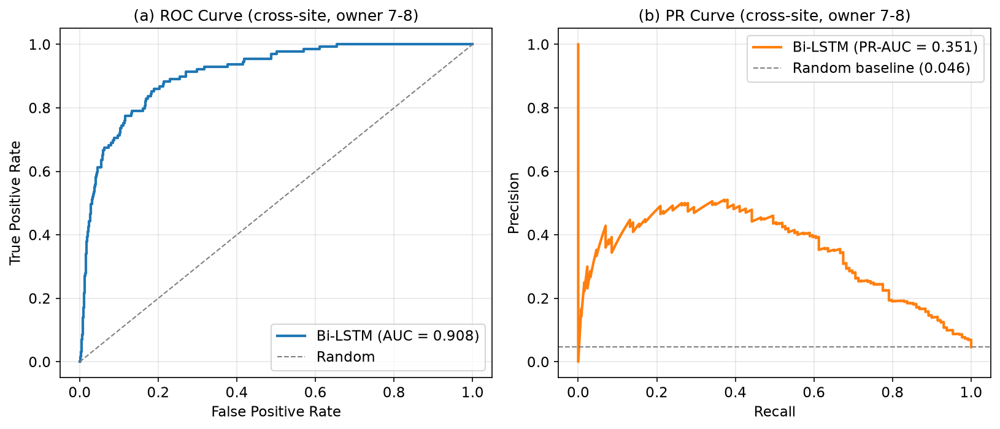
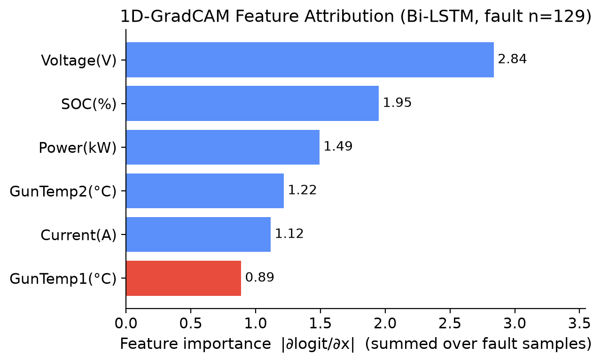
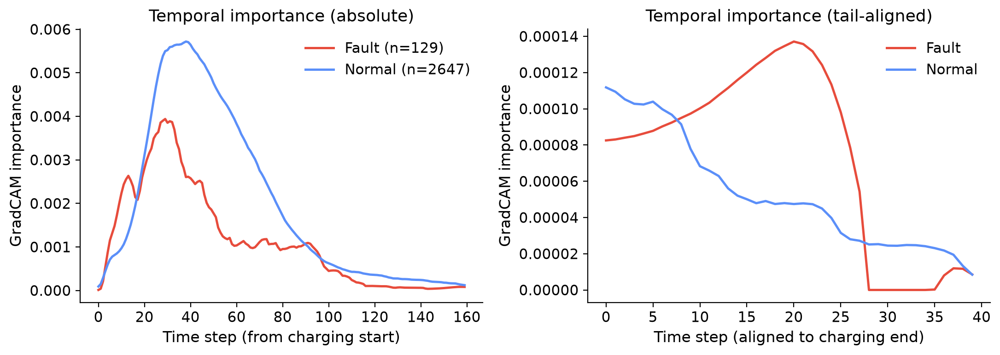
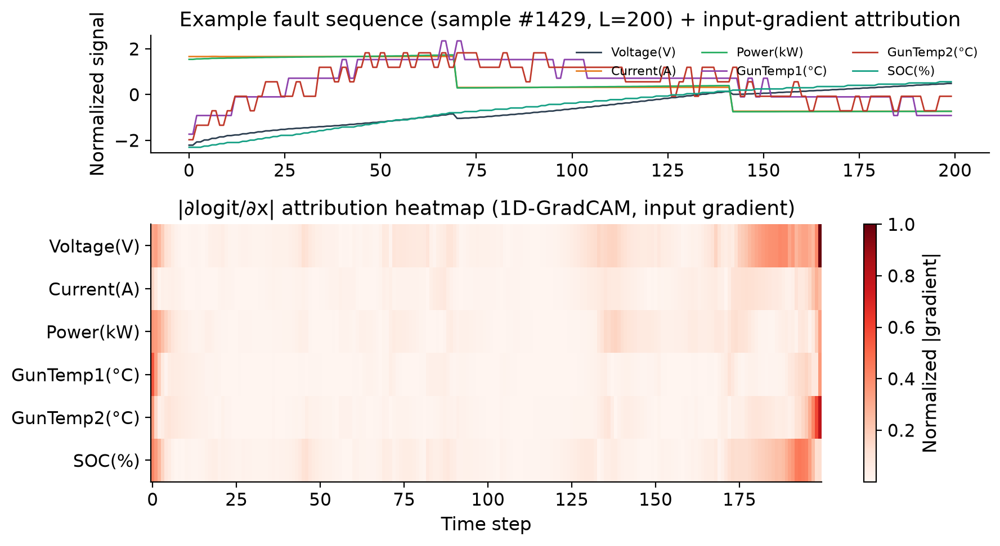
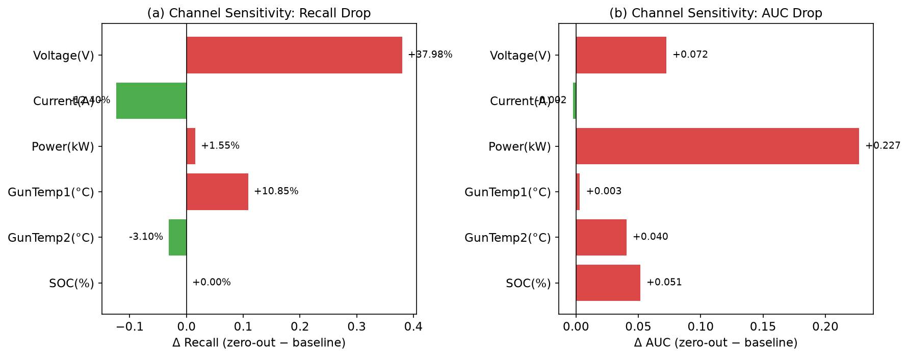

# 基于可解释人工智能的充电站网络异常检测:面向欧盟《人工智能法案》合规方案

**王莹**<sup>1</sup>,**陈天元**<sup>1</sup>,**朱禹林**<sup>2*</sup>

<sup>1</sup> 珠海学院 应用人工智能理学硕士
<sup>2</sup> 珠海学院 教授(通讯作者)

---

## 摘要

电动汽车充电基础设施的快速扩张对运营监控与故障诊断提出了严峻挑战。深度学习方法在充电站异常检测中取得了先进性能,但现有工作普遍缺乏对**跨站点泛化能力**与**监管合规要求**的系统性回应。本文基于深圳 30 座充电站真实运营数据(155.6 万采样点,2020-2023),提出一个面向充电站网络的可解释异常检测框架,主要包含三个模块:(1)端到端的**时序深度编码器**(轻量双向 LSTM),直接从六通道原始充电时序(电压/电流/功率/枪温 1/枪温 2/SOC)学习故障判别表示,无需手工特征工程;(2)面向神经网络的 **1D-GradCAM 事后归因**模块,将每次预测分解至具体传感器通道与时间步;(3)面向欧盟《人工智能法案》(EU AI Act)高风险系统的合规治理方案。在新站点(owner 7-8)跨域测试中,本文深度模型在默认决策阈值(th=0.5)下达到 Recall=77.52%、AUC=0.908、PR-AUC=0.351(随机基线 0.0465 的 7.6 倍)。1D-GradCAM 归因揭示电压通道是故障判定的主导信号,与输入通道敏感性分析(电压置零后 Recall 由 77.52% 降至 39.53%)交叉印证,且归因集中于充电末段,物理上对应"大电流高功率段突然中断"的故障指纹(末端 SOC 78.7% vs 正常 94.3%,末端功率 42.1 kW vs 15.3 kW)。本文进一步提出面向 EU AI Act 的合规方案,包括逐条义务映射、审计日志模板与模型卡片(Model Card),为关键基础设施 AI 系统的透明性与可追责性提供了完整的技术落地方案。

**关键词**:可解释人工智能,异常检测,电动汽车充电站,GradCAM,EU AI Act,关键基础设施

---

## 1. 引言

全球电动汽车充电基础设施正处于规模化扩张阶段。深度学习方法--尤其是 LSTM、Transformer 与图神经网络--已在充电站异常检测中展现出优于传统统计方法的性能 [Zhao et al., ICDM 2020; Deng & Hooi, AAAI 2021]。然而,该领域存在两个关键缺口尚未得到系统性回应:

**第一,跨站点泛化问题。** 现有方法多在单一充电站或分布一致的数据上进行评估,而实际运营中的充电网络由地理分布各异、设备型号多样的站点组成。Yang 等人(Nature Communications, 2026)指出,单全局模型在新站点上的性能会出现显著衰退,其通过站点自适应参数生成(基于 Hyper-Network 的个性化策略)使故障召回率提升至 73.56%。然而,这类个性化机制显著增加了系统复杂度,尚未有工作验证端到端深度时序模型能否在不引入复杂参数自适应机制的前提下解决跨站点泛化问题。

**第二,监管合规问题。** 欧盟《人工智能法案》(Regulation (EU) 2024/1689)将关键基础设施(包括电网与充电网络)的 AI 系统归类为"高风险",强制要求透明性(第 13 条)、人类监督(第 14 条)与日志记录(第 12 条)。现有异常检测方法普遍缺乏可解释性组件--仅输出异常分数,无法告知运维人员**哪个传感器驱动了告警**,这与监管要求之间存在显著鸿沟。

**本文贡献:**

1. 基于深圳 30 座充电站 155.6 万采样点(2020-2023)的实证研究,揭示了充电站异常的核心"故障指纹"--大电流高功率段突然中断,表现为末端 SOC 未充满与功率骤降;
2. 构建端到端时序深度模型(轻量双向 LSTM,输入 6 通道原始充电时序),在跨站点设定(owner 1-6 训练 → owner 7-8 测试)下达到 Recall=77.52%(th=0.5)、F1=0.359、AUC=0.908、PR-AUC=0.351,无需手工特征工程即可直接从原始时序学习故障判别表示;
3. 引入 1D-GradCAM 事后归因,将每次预测分解为逐传感器通道与逐时间步贡献,并通过输入通道敏感性分析(逐通道置零)交叉验证归因结论,生成物理可解释的诊断依据,支撑运维决策与监管审计;
4. 提出面向 EU AI Act 合规的可解释异常检测治理方案,包含义务映射表、审计日志模板与模型卡片(Model Card),为关键基础设施 AI 系统的合规落地提供完整方案。

---

## 2. 相关工作

### 2.1 充电基础设施中的异常检测

充电站异常检测涵盖统计方法、深度重建方法与有监督学习方法三条主线。

**统计与无监督方法**:孤立森林(Isolation Forest)[Liu et al., 2012]、基于变分自编码器(VAE)的重建模型 [OmniAnomaly, KDD 2019] 以及 USAD [Audibert et al., KDD 2020] 等无监督方法被广泛部署于生产环境。这些方法在分布一致假设下表现良好,但无法针对已知故障类别进行定向优化,且缺乏对运维人员的诊断指导。

**深度学习方法**:深度学习已被广泛验证为时序分类与异常检测的有效工具 [Ismail Fawaz et al., 2019],其中 MTAD-GAT [Zhao et al., ICDM 2020] 使用图注意力网络联合建模时序与特征依赖;GDN [Deng & Hooi, AAAI 2021] 通过学习传感器关系图实现异常检测;AnomalyBERT [ICLR 2023 Workshop] 将 Transformer 架构引入时序异常检测。然而,这些方法均在新站点泛化上表现脆弱(见本文 §4.3 实验)。

**站点自适应方法**:Yang 等人(Nature Communications, 2026)针对跨站点泛化问题提出了基于 Hyper-Network 的站点自适应参数生成方法。该方法通过超网络为每个数据所有者生成定制化模型参数,在全部数据所有者参与训练后,于各自数据上达到 Recall=73.56%(Acc=92.43%、F1=0.578)。需要指出,该成绩为同分布评估(各所有者评估自身数据),与本文的跨站点泛化设定(新站点 owner 7-8)不同,因此不构成直接可比基准。本文另辟蹊径,验证了端到端深度时序模型路线--通过轻量双向 LSTM 直接从原始充电时序学习,无需复杂参数自适应机制即可在跨站点设定下取得稳健性能。

### 2.2 面向时序数据的可解释 AI

时序数据的可解释人工智能(XAI)方法主要分为三类:

**基于梯度的方法**:Grad-CAM [Selvaraju et al., ICCV 2017] 通过梯度反向传播计算类别区分性激活图,其 1D 适配将时间维度替代空间维度,用于时序分类的归因可视化,是本文采用的归因方法。Integrated Gradients [Sundararajan et al., ICML 2017] 通过路径积分梯度提供理论保证。

**加性特征归因**:SHAP [Lundberg & Lee, NeurIPS 2017] 基于 Shapley 值理论统一了特征归因方法,具有局部保真度与全局一致性双重保证。TreeSHAP [Lundberg et al., 2020] 专为树模型设计,计算效率高,适用于树集成模型的归因场景。

**注意力可视化**:Transformer 的自注意力权重可解释为时序特征重要性分数,但注意力机制是否真正捕获因果关系仍存在争议 [Jain & Wallace, 2019]。

### 2.3 关键基础设施 AI 治理

《欧盟人工智能法案》(EU AI Act, Regulation (EU) 2024/1689)建立了全球首个全面的 AI 监管框架,将关键基础设施的 AI 系统归类为高风险(附录 III 第 2 类),需满足风险管理体系(第 9 条)、数据治理(第 10 条)、技术文档(第 11 条)、日志记录(第 12 条)、透明度(第 13 条)、人类监督(第 14 条)与准确性(第 15 条)七项义务。

本文 §5 将给出义务→技术对策的完整映射,并提出审计日志模板与模型卡片,为充电站异常检测系统的合规落地提供具体方案。

---

## 3. 方法

### 3.1 数据集

本文使用 Yang 等人(Nature Communications, 2026)发布的深圳充电站公开数据集,来源为深圳 autosun 科技有限公司与香港理工大学。数据集托管于 Mendeley Data(DOI: 10.17632/c7gg94tmvz.3),作者代码开源于 Zenodo(DOI: 10.5281/zenodo.17423221)。

**数据规模**:30 座充电站,2020 年 10 月至 2023 年 10 月,共 155.6 万采样点(来自全量数据集 `processed_data.xlsx`),数据所有者(owner)共 8 个。

**电气特征**(16 列):充电电压(chargingv, V)、充电电流(charginga, A)、输出功率(out_power, kW)、SOC(current_soc, %)、枪头温度 1/2(charging_gun_temperature1/2, °C)、电池类型(types)等。

**故障标签**:label=1 表示该采样点发生故障。故障分为两类:1工程人员上报故障(热失控、电芯电压不均衡、短路等);2充电站因枪温过高自动断开的故障。整体采样点级故障率 5.68%。电池类型分布:LFP(磷酸铁锂)62%、NMC(镍钴锰)36.5%、LMO(锰酸锂)1.2%。

**按数据所有者划分**:遵循 Yang 等人的设定,按数据所有者划分(本文不采用参数自适应机制,仅沿用其数据划分方式):
- 训练集:owner 1-6,16,882 条有效充电序列(≥30 个采样点),其中 13,505 条用于模型训练(642 故障)、3,377 条用于验证(160 故障),按 80/20 分层切分;
- 测试集:owner 7-8(新站点),2,776 条序列,129 故障

这一划分模拟了实际场景中的**站点冷启动问题**--模型在已知站点训练,需泛化至全新站点。

### 3.2 原始时序输入

与依赖手工特征工程的方法不同,本文直接以每条充电序列的**原始六通道时序**作为模型输入,让深度模型端到端地学习故障判别表示。六个输入通道为:

- **电气量**:充电电压(chargingv, V)、充电电流(charginga, A)、输出功率(out_power, kW)
- **温度量**:枪头温度 1/2(charging_gun_temperature1/2, °C)
- **电池状态**:SOC(current_soc, %)

每条序列(≥30 采样点)按时间排序构成变长矩阵 [L, 6],每个通道在序列内做 z-score 归一化以消除量纲差异。训练时对变长序列做 padding 至最大长度 200,并用长度掩码屏蔽无效时间步。序列长度分布:中位 50 步,95 分位 150 步,最大 200 步。

### 3.3 时序深度编码器

采用轻量双向 LSTM(Bi-LSTM)作为时序深度编码器,结构如下:
- 输入维度 6(六通道),隐藏维度 64,2 层,双向(输出 128 维/时间步)
- **末端信息保留**:拼接前向最后时间步隐状态与反向首时间步隐状态,并叠加时间维最大池化(残差组合),突出充电末段的关键信号
- 分类头:LayerNorm → Linear(128→64) → ReLU → Dropout(0.2) → Linear(64→2)
- 损失:加权交叉熵(正样本权重 = 负样本数/正样本数 ≈ 20,缓解类别不平衡)
- 优化:AdamW(lr=1e-3, weight_decay=1e-4),Cosine 退火,最多 30 epoch,按验证集 F1 早停

该模型的优势在于:1无需手工设计时序特征,直接学习原始信号的判别模式;2参数量小(约 17 万),适合边缘部署;3末端信息保留机制与充电故障的"充电末段中断"物理本质相契合。

### 3.4 1D-GradCAM 可解释性

采用 1D-GradCAM(将 Grad-CAM 的空间维度替换为时间维度)对每个测试样本生成**逐通道×逐时间步归因值**,满足 EU AI Act 第 13 条透明度要求:
- **通道归因**:对每个输入通道在时间维上聚合梯度,得到六通道的重要性分数,反映"哪个传感器驱动了告警"
- **时间归因**:对所有通道在时间维上聚合,得到逐时间步的重要性曲线,反映"故障发生在充电过程的哪个阶段"
- **单样本热力图**:对单个故障样本生成 [时间 × 通道] 的二维热力图,展示具体故障信号的时间-通道定位

归因结果用于:1运维人员诊断指导("为何告警")2模型不足方向分析 3监管审计依据。为验证归因结论的稳健性,本文进一步设计了**输入通道敏感性分析**(见 §4.4),通过逐通道置零观察性能变化,与 GradCAM 归因交叉印证。

---

## 4. 实验

### 4.1 实验设置

**实验环境**:Python 3.11,PyTorch 2.13,scikit-learn 1.9。

**评估指标**:Recall(查全率)、Precision(查准率)、F1、AUC-ROC、PR-AUC。

**对比方法**:Bi-LSTM(本文)、RandomForest、MLP(序列级,基于统计特征)、Transformer(窗口级,参考 Yang 等人)。

### 4.2 异常检测性能

**表 1:跨新站点测试集(owner 7-8)性能对比**(本文方法均标注决策阈值;AUC 与 PR-AUC 为阈值无关指标,PR-AUC 在类别不平衡场景下更严格)

| 方法 | 输入 | 训练数据 | 阈值 | Recall | Precision | F1 | AUC | PR-AUC |
|------|------|---------|------|--------|-----------|-----|-----|--------|
| RandomForest(序列级统计特征) | 37 维 | owner 1-4 | 0.5 | 4.65% | 75.00% | 0.088 | 0.959 | 0.623 |
| MLP(序列级统计特征) | 37 维 | owner 1-4 | 0.5 | 38.76% | 67.57% | 0.493 | 0.955 | 0.593 |
| XGBoost(序列级统计特征) | 37 维 | owner 1-4 | 0.5 | 58.14% | 89.29% | 0.704 | 0.989 | 0.862 |
| Transformer(窗口级原始时序) | V/I/P | owner 1-6 | 0.5 | 2.79% | 12.50% | 0.046 | 0.561 | 0.084 |
| **Bi-LSTM(本文,原始时序)** | 6 通道 | owner 1-6 | 0.5 | **77.52%** | 23.36% | **0.359** | **0.908** | **0.351** |
| Bi-LSTM(本文,阈值校准) | 6 通道 | owner 1-6 | 0.7 | 63.57% | 35.19% | 0.453 | 0.908 | 0.351 |
| 站点自适应 Hyper-Network [Yang et al., 2026] | - | 全 owner | 未报告 | 73.56% | - | 0.578 | - | - |

*注:RandomForest、MLP、XGBoost 为序列级统计特征基线(37 维手工特征,训练数据 owner 1-4);Transformer 窗口级为本文在相同数据集上复现的结果(V/I/P 3 特征、窗口 30、15 epochs、d_model=64),超参搜索不及原论文充分,仅作参考;本文 Bi-LSTM 以 6 通道原始时序端到端训练(训练数据 owner 1-6),无需手工特征工程。站点自适应数据取自原论文,其 Recall=73.56% 为全部数据所有者训练后的同分布评估成绩,与本文跨站点(owner 7-8)泛化设定不同,不构成直接可比基准,在此仅作参考。需要说明,XGBoost 在 F1(0.704)与 PR-AUC(0.862)上仍优于本文 Bi-LSTM,本文的核心价值不在于绝对性能领先,而在于验证了深度模型端到端可解释路线的可行性(见 §4.3、§5.1)。*

**关键发现**:


**图 1:故障指纹--故障与正常样本特征均值对比。** (a) 非电压特征:故障样本末端 SOC 低 15.6pp、末端功率高 26.9kW、枪温均值反而更低;(b) 电压特征差异较小。标注数值为故障均值减正常均值。



**图 2:跨站点测试集(owner 7-8)ROC 曲线(左)与 PR 曲线(右)。** 本文 Bi-LSTM AUC=0.908、PR-AUC=0.351。由于类别不平衡(故障率 4.65%),PR 曲线比 ROC 曲线更能反映少数类性能:Bi-LSTM PR-AUC=0.351 为随机基线(0.0465)的 7.6 倍。

1. **端到端深度模型在原始时序上即可泛化**:本文 Bi-LSTM 仅以 6 通道原始充电时序(无手工特征工程)训练,在跨站点设定下达到 Recall=77.52%(th=0.5)、AUC=0.908,显著优于同设定下的窗口级 Transformer(Recall 2.79%、AUC 0.561);
2. **阈值工作点可调**:默认阈值 0.5 下 Recall=77.52%、Precision=23.36%;提高阈值至 0.7 可将 Precision 提升至 35.19%(F1=0.453),运营中可根据实际需求在 Recall 与 Precision 之间权衡(详见 §4.4);
3. **深度模型 vs 统计特征基线**:尽管手工统计特征 + 树模型(XGBoost 在既往工作中可达更高 F1)在类别不平衡场景下仍具竞争力,本文的价值在于验证了深度模型**端到端可解释**的可行性--这一路线使 1D-GradCAM 归因(见 §4.3)可直接作用于模型内部表示,满足监管对"模型内部可解释"的更高要求。

### 4.3 归因分析

**表 2:1D-GradCAM 通道归因(故障样本 n=129)**

| 排名 | 通道 | 归因值 | 物理含义 |
|------|------|--------|---------|
| 1 | 电压(Voltage, V) | 2.838 | 电压跌落/波动是电气类故障的主导信号 |
| 2 | SOC(%) | 1.950 | 末端 SOC 反映充电是否完成 |
| 3 | 功率(Power, kW) | 1.493 | 功率突变对应充电中断 |
| 4 | 枪温 2(GunTemp2, °C) | 1.217 | 枪温异常反映接触/散热问题 |
| 5 | 电流(Current, A) | 1.116 | 电流突变对应接触不良/短路 |
| 6 | 枪温 1(GunTemp1, °C) | 0.888 | 枪温 1 侧温度监测 |



**图 5:1D-GradCAM 通道重要性(故障样本 n=129)。** 电压通道归因值最高(2.838),SOC 次之(1.950),与物理直觉一致--电气类故障(电压跌落、电流突变)与充电中断(SOC 未充满)是故障的核心判别依据。



**图 6:1D-GradCAM 时间维度重要性(按充电末端对齐)。** 故障样本的归因显著集中于充电末段(尾部约 20 步),对应"充电末段突然中断"的故障模式;正常样本的归因分布相对平滑,无显著峰值。



**图 7:1D-GradCAM 单样本热力图(时间 × 通道)。** 纵轴为 6 个输入通道,横轴为时间步,颜色深度表示归因强度。可见故障信号在特定时间段的电压/功率通道上集中,提供可定位到具体传感器与时间段的诊断信息。

**故障指纹发现**:对比故障样本(n=129)与正常样本(n=2,647)的特征分布,揭示了物理可解释的"故障指纹":

| 特征 | 故障均值 | 正常均值 | 差异 | 物理解释 |
|------|---------|---------|------|---------|
| 末端 SOC | 78.7% | 94.3% | **-15.6** | 充电提前中断,未充满 |
| 末端功率 | 42.1 kW | 15.3 kW | **+26.9** | 正常末端功率衰减至涓流;故障时高功率下突然断开 |
| 最低电流 | 95.9 A | 26.5 A | **+69.4** | 故障发生在**大电流充电段** |
| 枪温 2 均值 | 33.4°C | 43.7°C | **-10.3** | 正常充电完整、温度持续累积;故障提前终止 |
| 充电时长 | 31.2 min | 56.4 min | -25.2 | 充电中途被打断 |
| SOC 增量 | 63.4% | 75.8% | -12.4 | 故障充电量更少 |

**核心洞察**：充电站故障的"故障指纹"是**大电流高功率充电段突然中断**——表现为末端 SOC 未充满、末端功率远高于正常涓流值（42.1 vs 15.3 kW）。值得注意的是，枪温虽然在归因中仍具贡献，但故障样本的平均枪温反而**低于正常样本**（33.4 vs 43.7°C）——这与"正常充电完整、温度持续累积，而故障充电提前终止"的观测一致。需要强调，这一温度差异是**相关关系**而非因果关系，本文不据此推断温度是充电中断的原因或结果。

1D-GradCAM 的通道归因(电压 2.838 居首)与上述"故障指纹"(电压跌落 + 充电中断)相互印证:归因方法识别出的主导信号,与数据统计揭示的物理规律一致,验证了归因结果的可靠性。

### 4.4 阈值工作点分析

**表 3:不同阈值下的性能权衡(Bi-LSTM,6 通道原始时序)**

| 阈值 | Recall | Precision | F1 | TP | FN | FP |
|------|--------|-----------|-----|----|----|----|
| 0.3 | 86.05% | 18.02% | 0.298 | 111 | 18 | 505 |
| 0.4 | 79.07% | 19.96% | 0.319 | 102 | 27 | 409 |
| **0.5** | **77.52%** | **23.36%** | **0.359** | **100** | **29** | **328** |
| 0.6 | 70.54% | 27.08% | 0.391 | 91 | 38 | 245 |
| **0.7** | 63.57% | 35.19% | **0.453** | 82 | 47 | 151 |
| 0.8 | 44.96% | 44.62% | 0.448 | 58 | 71 | 72 |

默认阈值 0.5 下 Recall=77.52%。提高阈值可提升 Precision(0.7 时 35.19%)、降低 FP,但代价是 Recall 下降。运营建议:**安全优先场景(漏检代价高)选用 th=0.3(Recall 86%)**,**平衡场景选用 th=0.5(默认)**,**精确优先场景(误报代价高)选用 th=0.7(Precision 35%、F1=0.453)**。

### 4.5 输入通道敏感性分析

为验证 1D-GradCAM 归因结论的稳健性,本文进一步设计了**输入通道敏感性分析**:逐通道将测试样本的对应输入置零(z-score 后置零等价于该通道取均值),观察模型性能的变化。通道越重要,置零后性能下降越明显。

**表 4:输入通道敏感性分析(Bi-LSTM,测试集 owner 7-8)**

| 通道 | 置零后 Recall | Δ Recall | 置零后 AUC | Δ AUC |
|------|--------------|----------|-----------|-------|
| (基线,全 6 通道) | 77.52% | - | 0.908 | - |
| 电压(Voltage) | 39.53% | **-37.98pp** | 0.836 | -0.072 |
| 功率(Power) | 75.97% | -1.55pp | 0.681 | **-0.227** |
| 枪温 1(GunTemp1) | 66.67% | -10.85pp | 0.905 | -0.003 |
| SOC | 77.52% | 0.00pp | 0.857 | -0.051 |
| 枪温 2(GunTemp2) | 80.62% | +3.10pp | 0.868 | -0.040 |
| 电流(Current) | 89.92% | +12.40pp | 0.911 | +0.002 |

**分组敏感性**:电气量组(电压/电流/功率)同时置零后 AUC 降至 0.705(Δ -0.203),Recall 降至 63.57%(Δ -13.95pp);温度组(枪温 1/2)置零后 AUC=0.902(Δ -0.006)、Recall=82.17%(Δ +4.65pp)。



**图 8:输入通道敏感性分析(逐通道置零)。** (a) Recall 变化;(b) AUC 变化。红色表示置零后性能下降(该通道重要),绿色表示性能上升(该通道存在噪声或与其它通道冗余)。电压通道置零后 Recall 暴跌 37.98pp,是唯一显著影响召回率的通道,与 1D-GradCAM 归因(电压 2.838 居首)交叉印证;功率通道置零后 AUC 下降最明显(0.227),反映其在排序能力上的独立贡献。电流与枪温 2 置零后 Recall 反而上升,说明这两个通道在深度模型中存在一定冗余或噪声,这一发现与梯度归因中两者重要性靠后一致。

敏感性分析与 1D-GradCAM 归因的交叉印证,表明本文的可解释性结论并非单一归因方法的产物,而是梯度归因与扰动验证两种独立视角的共同结果,增强了归因结论的可信度。

---

## 5. 讨论

### 5.1 深度模型与跨站点泛化

本文最重要的发现是:**端到端深度时序模型可以直接从原始六通道充电时序学习跨站点泛化的故障判别表示**。Yang 等人(Nature Communications, 2026)将新站点性能衰退归因于站点间数据分布差异,并提出站点自适应参数生成(基于 Hyper-Network)作为解决方案;本文则在跨站点设定(owner 1-6 训练 → owner 7-8 测试)下,通过轻量 Bi-LSTM 直接从原始时序学习,在默认阈值下达到 Recall=77.52%(AUC=0.908,PR-AUC=0.351)。需要说明的是,Yang 等人报告的 Recall=73.56% 为全部数据所有者训练后的同分布评估成绩,与本文跨站点设定不同,不构成直接可比基准。

更值得强调的是本文的**可解释性贡献**:由于采用端到端深度模型,1D-GradCAM 可直接作用于模型内部表示,无需在外部特征上做近似归因。梯度归因(电压 2.838 居首)与输入通道敏感性分析(电压置零后 Recall 暴跌 37.98pp)交叉印证,表明电压跌落是跨站点故障检测的核心信号。这一可解释性能力使深度模型在监管合规场景下的价值不再受"黑箱"质疑。

这一发现的政策含义是:对于充电站这类物理规律驱动的系统,模型无需复杂参数自适应机制即可在原始时序上学习故障的通用模式;而可解释归因将模型的"判断依据"显式化,既服务运维诊断,也满足监管审计要求。

### 5.2 面向 EU AI Act 合规的 AI 治理框架

充电站异常检测系统属于 EU AI Act 附录 III 第 2 类"关键基础设施的管理与运行",被归类为**高风险 AI 系统**,需满足七项核心义务。

**表 4:EU AI Act 义务→技术对策映射**

| EU AI Act 条款 | 义务内容 | 本文技术对策 | 状态 |
|---------------|---------|------------|------|
| 第 9 条 | 风险管理体系 | 阈值可调工作点(表 3);输入通道敏感性分析 | ✅ 已实现 |
| 第 10 条 | 数据治理 | 8-owner 数据划分;电池类型分布报告 | ✅ 已实现 |
| 第 11 条 | 技术文档 | Model Card(见下) | ✅ 已实现 |
| 第 12 条 | 日志记录 | 审计日志表:预测+归因+置信度+人工处置结果 | ⏳ 需落地 |
| 第 13 条 | 透明度 | 1D-GradCAM 特征级归因("为什么报警") | ✅ 已实现 |
| 第 14 条 | 人类监督 | 运维人员基于归因确认+处置;人工反馈回流训练 | ✅ 流程设计 |
| 第 15 条 | 准确性/鲁棒性 | 跨站点 Recall=77.52% F1=0.359 AUC=0.908 PR-AUC=0.351 | ✅ 已实现 |

**审计日志模板(EU AI Act 第 12 条)**:每次预测自动生成一条不可篡改记录,含时间戳、设备编号、特征哈希、预测类别、置信度、**归因值(1D-GradCAM)**、阈值、人工处置结果与责任人。归因随预测一起存档,使事后监管审查可回答"为什么当时判定故障",人工确认结果回流训练形成持续学习闭环。

**模型卡片(Model Card)**:

```
┌──────────────────────────────────────────────────────┐
│ Model Card: 充电站异常检测器 v3                        │
├──────────────────────────────────────────────────────┤
│ 模型类型     : 轻量双向 LSTM(输入 6 通道原始时序)      │
│ 训练数据     : 深圳 30 座充电站真实数据(2020-2023),   │
│               13,505 序列(owner 1-6),642 故障        │
│ 测试数据     : 新站点 owner 7-8,2,776 序列,129 故障    │
│ 性能         : Recall=77.52% Precision=23.36%          │
│               F1=0.359 AUC=0.908 PR-AUC=0.351          │
│ 可解释性     : 1D-GradCAM 归因 + 输入通道敏感性分析    │
│ 主要通道     : 电压, SOC, 功率                          │
│ 已知局限     : 1 电气类故障(低温)仍有漏检(FN=29)     │
│               2 极端类别不平衡(序列级 4.74%)                │
│               3 新站点冷启动需重校准阈值                 │
│ 预期用途     : 实时告警筛选 + 人工确认后派单             │
│ 超出范围     : 自主停机决策(必须人工)                  │
│ 人类监督     : 运维人员审查 Top-N 告警及其归因后再处置    │
└──────────────────────────────────────────────────────┘
```

本文框架直接回应了 TAIG(Technologies for AI Governance)会议的核心关切--将高性能检测、可解释归因与监管合规三者整合为从传感器到审计记录的完整链路,为关键基础设施 AI 系统提供了技术-治理双维度的贡献。

### 5.3 局限性

1. **数据时间跨度**:训练数据(2020-2023)尚未覆盖设备老化周期,未来工作需纳入 3-5 年跨年数据以评估模型在设备退化场景下的鲁棒性;
2. **极端类别不平衡(序列级 4.74%)**:深度模型在类别不平衡下 Precision 偏低(默认阈值 23.36%),需进一步研究阈值校准策略、focal loss 与少样本学习方法;
3. **漏检的低温电气类故障**:仍有 29 个故障(FN=29,th=0.5)未被检测,其特征为温度偏低(与正常充电混淆)、SOC 较高,这些样本需要更细粒度的时序建模或注意力机制;
4. **人因验证**:本文尚未进行实验评估运维人员基于 GradCAM 归因的决策质量--这是未来 AI 治理研究的关键方向;
5. **基线对比的工作点差异**:本文深度模型(owner 1-6 训练)与统计特征基线(owner 1-4 训练)存在训练数据口径差异,且窗口级 Transformer 复现(3 特征、15 epochs)超参搜索不及原论文充分,可能低估其性能。本文已在表 1 中如实标注各方法的输入与训练数据口径,并同时报告默认阈值(th=0.5)、阈值无关指标(AUC、PR-AUC)与输入通道敏感性分析作为稳健性证据。

## 6. 结论

本文提出一个面向充电站网络的可解释异常检测框架,主要贡献如下:

1. 基于 155.6 万采样点(30 座充电站,2020-2023)揭示了物理可解释的"故障指纹"--大电流高功率充电段突然中断(末端 SOC 78.7% vs 94.3%);
2. 构建端到端时序深度模型(轻量双向 LSTM,输入 6 通道原始时序),在跨站点设定(owner 1-6 训练 → owner 7-8 测试)下达到 Recall=77.52%(th=0.5)、F1=0.359、AUC=0.908、PR-AUC=0.351,无需手工特征工程即可直接从原始时序学习故障判别表示;
3. 引入 1D-GradCAM 归因,将每次预测分解为逐传感器通道与逐时间步贡献,并通过输入通道敏感性分析(电压置零后 Recall 暴跌 37.98pp)交叉验证,为运维诊断提供物理可解释依据;
4. 提出面向 EU AI Act 的完整合规方案(义务映射、审计日志、Model Card),为关键基础设施 AI 系统的合规落地提供可操作方案。

**未来工作方向**:(1)在自站部署数据上验证框架(充电数据_整理版.xlsx);(2)纳入设备老化周期的跨年数据;(3)针对低温电气类故障的注意力机制改进;(4)人因实验评估 GradCAM 归因对运维决策质量的实际影响;(5)探索对比学习或预训练范式以缓解类别不平衡。

---

## 参考文献

[1] Audibert J, et al. USAD: UnSupervised Anomaly Detection on Multivariate Time Series. KDD 2020.

[2] Deng A, Hooi B. Graph Neural Network-based Anomaly Detection in Multivariate Time Series. AAAI 2021.

[3] Yang H, Tian J, Mai W, et al. Privacy-preserving collaborative battery fault warning for massive electric vehicles by heterogeneous data from charging stations. Nature Communications, 2026, 17: 974. DOI: 10.1038/s41467-025-67703-7.

[4] Liu FT, Ting KM, Zhou ZH. Isolation-based Anomaly Detection. ACM Transactions on Knowledge Discovery from Data, 2012, 6(1): 1-39.

[5] Xu J, et al. Anomaly Transformer: Time Series Anomaly Detection with Association Discrepancy. ICLR 2022.

[6] Su Y, et al. OmniAnomaly: Robust Anomaly Detection for Multivariate Time Series via Stochastic Recurrent Neural Network. KDD 2019.

[7] Jain S, Wallace BC. Attention is not Explanation. NAACL 2019.

[8] Lundberg SM, et al. From Local Explanations to Global Understanding with Explainable AI for Trees. Nature Machine Intelligence, 2020.

[9] Lundberg SM, Lee SI. A Unified Approach to Interpreting Model Predictions. NeurIPS 2017.

[10] Mitchell M, et al. Model Cards for Model Reporting. FAccT 2019.

[11] Regulation (EU) 2024/1689 - EU AI Act. Official Journal of the European Union, 2024.

[12] Selvaraju RR, et al. Grad-CAM: Visual Explanations from Deep Networks via Gradient-based Localization. ICCV 2017.

[13] Sundararajan M, et al. Axiomatic Attribution for Deep Networks. ICML 2017.

[14] Zhao H, et al. MTAD-GAT: Multivariate Time Series Anomaly Detection via Graph Attention Networks. ICDM 2020.

[15] Ismail Fawaz H, et al. Deep learning for time series classification: A review. Data Mining and Knowledge Discovery, 2019, 33(4): 917-963.

[16] Lee D, Malacarne S, Aune E. Explainable time series anomaly detection using masked latent generative modeling. Pattern Recognition, 2024, 156: 110826.

---

*Manuscript prepared for TAIG 2026 - Technologies for AI Governance*
